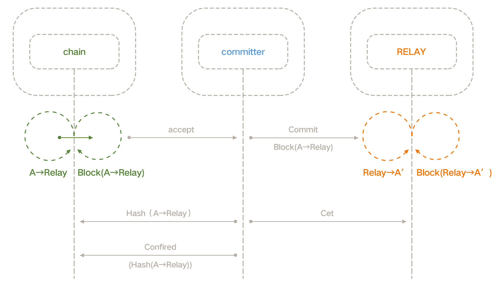
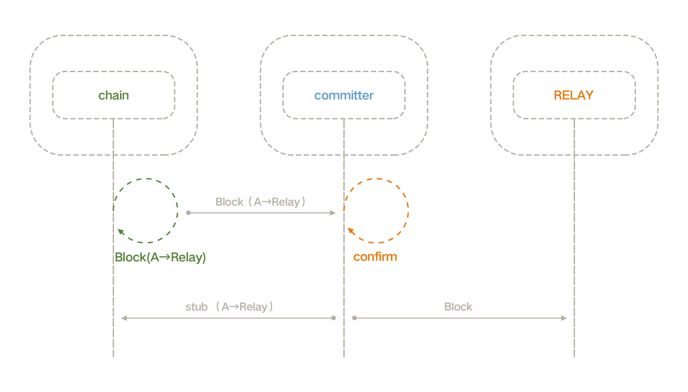

# Codex Trunk
Trunk node for between chains

- [Codex Trunk](#codex-trunk)
  - [Introduction](#introduction)
    - [Design](#design)
    - [Types](#types)
    - [Governance](#governance)
  - [Installation](#installation)
  - [Config](#config)


## Introduction

Trunk is part of the Codex muit-chain system. 
Some trunk node provides a decentralized state synchronization channel between the two chains. 
In particular, all chains in codex muit-chain system will have a channel by trunk nodes to codex.relay chain, so every chains can share their state to others by this.

### Design

The CODEX relay chain provides relay services between the chains. 
In the CODEX multi-chain system, chains and chains do not directly interact with each other, but through the CODEX relay chain. 
For hide the different between chains in the process of cross-chain, we add a 'relay layer' called `trunk`.
`Trunk` can provide a state transmission channel between any two chains.

Different chains often have different governance structures and economic models,  
So the channel in the symmetrical direction will not be equal.

### Types

Support two chains called A and B, there are three types of trunk nodes: Committer, Watcher, and Checker,

- **Committer** : commit chain A block to B
- **Watcher** : commit chain B state change to A
- **Checker** : check committers and watchers

Committer can send block to other chain:



Watcher can handler state change from other chain:




### Governance

Nodes in trunks need build governance way. 

TODO: some examples

## Installation

First build the trunk

```bash
go get -u -v github.com/codexnetwork/trunk
cd $GOPATH/src/github.com/codexnetwork/trunk
go get -v ./...
go install
```

You can use `-h` to get params for trunk:

```
trunk -h
Usage of ./trunk:
  -cfg string
    	config file path (default "./config.json")
  -d	run in debug mode
```

After make a config, can start trunk by:

```bash
trunk -cfg /path/to/config.json
```

## Config

Now, we support chain A need connect to codex.relay chain by trunks,
chain A is a chain bios by eosio.

By this way, we set the A is side chain, codex.relay is relay chain.

we need start a committer node and a watcher node,
committer node config like this:

```json
{
    "chains": [{
        "name": "relay",
        "typ": "forceio",
        "startNum": 10000,
        "p2p": [
            "127.0.0.1:8101"
        ],
        "cfg": {
            "url": "http://127.0.0.1:8001",
            "pri":["5KQwrPbwdL6PhXujxW37FSSQZ1JiwsST4cqQzDeyXtP79zkvFD3"]
        }
    }, {
        "name": "side",
        "typ": "eosio",
        "startNum": 10000,
        "p2p": [
            "192.168.2.180:9001","192.168.2.180:9002","192.168.2.180:9003"
        ],
        "cfg": {
            "url": "http://192.168.2.180:8001",
            "pri":["5KQwrPbwdL6PhXujxW37FSSQZ1JiwsST4cqQzDeyXtP79zkvFD3"]
        }
    }],

    "transfer": [{
        "sideacc": "transferc",
        "relayacc": "testc"
    }],

    "relay":{
        "chain":"a",
        "relaycontract":"rs.contract"
    }
}

```

First we need to config chain info, there is two chain: `A` and `codex.relay`.

`A` is "side" in config and `codex.relay` is "relay" in config:

```json
   ...

    "chains": [{
        "name": "relay",
        "typ": "forceio",
        ...
    }, {
        "name": "side",
        "typ": "eosio",
        ...
    }],

    ...
```

`typ` is the type to chain:

- `eosio` : chain boot by eosio
- `eosforce` : chain boot by eosforce
- `forceio` : chain boot by codexio, also codex.relay
- `enu` : the enu chain
- `bos` : the bos chain
- `telos` : the telos chain

a chain config is like this in `chains` array:

```json
   {
        "name": "relay", // "side" or "relay"
        "typ": "forceio", // chain typ
        "startNum": 10000, // start sync block num, some chain has boot for a long time, so it is no need to sync all block
        "p2p": [
            "127.0.0.1:8101" // chain p2p address
        ],
        "cfg": {
            "url": "http://127.0.0.1:8001", // chain http url
            "pri":["5KQwrPbwdL6PhXujxW37FSSQZ1JiwsST4cqQzDeyXtP79zkvFD3"] // pri key for trunker 's account in this chain
        }
    }
```

committer need two account: in chain A, committer has a account called `chain.a.acc`, 
in codex.relay chain, committer has a account called `relay.a.acc`,
so the `transfer` config will be :

```json
    "transfer": [{
        "sideacc": "chain.a.acc",
        "relayacc": "relay.a.acc"
    }],
```

and watcher config is like this:

```json
...
    "watcher": [{
        "sideacc":"chain.a.acc",
        "relayacc": "relay.a.acc"
    }],
...
```

at last, we need config channel info, this should some for all trunks:

```json
    "relay":{
        "chain":"a", // chain channel name
        "relaycontract":"rs.contract" // relay contract in side chain
    }
```